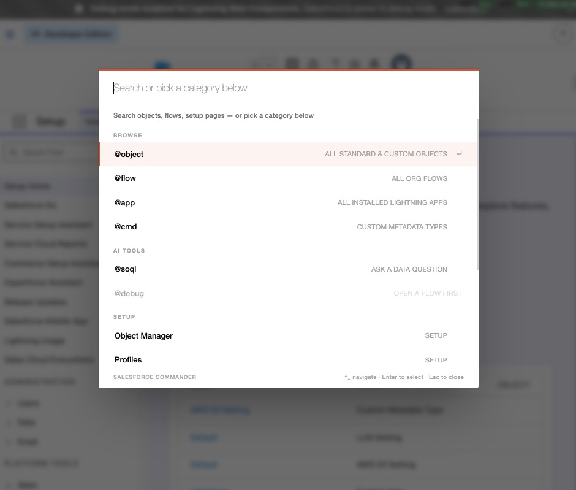
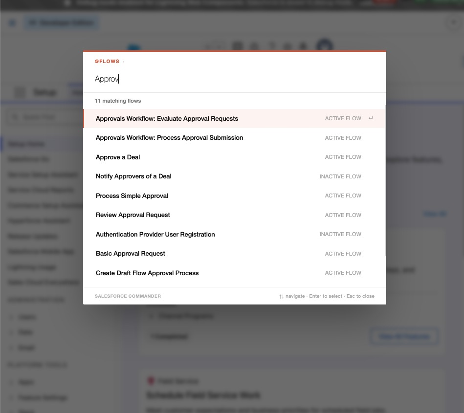
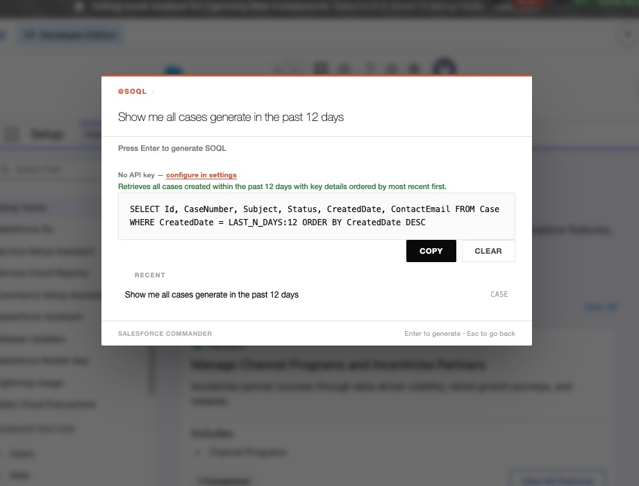
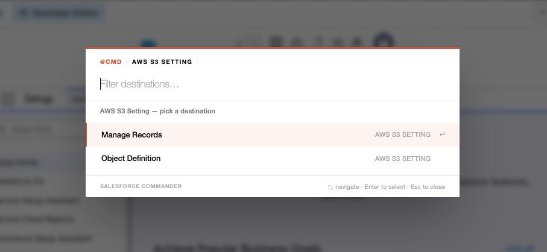
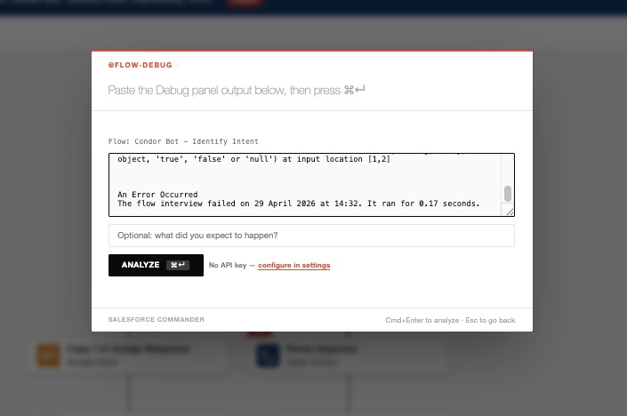
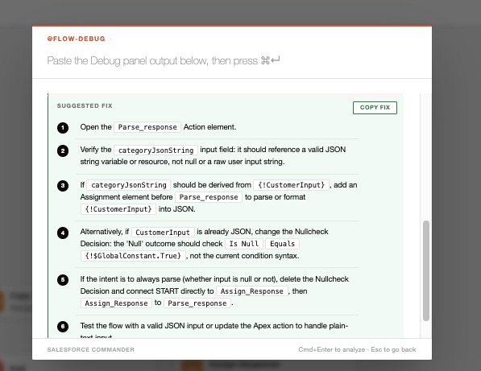

# Skipper for Salesforce

**Grounding and guardrails for AI in Salesforce.**

A keyboard-first command palette for Salesforce. Press `⌘⇧K` (Mac) or `Ctrl+Shift+K` (Windows/Linux) on any Salesforce page and jump to any object, field, flow, or setup page in seconds. 

> Built for admins, developers, and consultants who live in Salesforce Setup all day and would like to spend less time clicking through menus.

## Install

1. Install from the Chrome Web Store (link to come once approved), or load unpacked for development:
   - Clone this repo, open `chrome://extensions`, enable **Developer mode** (top-right), click **Load unpacked**, select the project folder.
2. (Optional, for the AI assistants) Right-click the extension icon → **Options** → pick a provider (Gemini, Claude, or GPT) and paste your API key. Gemini has a free tier; the others are billed pay-as-you-go directly by the provider.

After changing any source file in dev mode, click the reload icon for the extension on `chrome://extensions`.

## Features

### AI assistants (bring your own provider key)

Choose **Gemini** (Google), **Claude** (Anthropic), or **GPT** (OpenAI) in Options. Your key is stored in this browser's local extension storage and is sent only to the provider you picked.

- **SOQL Generator (`@soql`)** — Describe what you want in plain English; the model returns a `SELECT` query that uses real field names from the object's describe (no hallucinated fields), validated against the Salesforce planner. The query is copied to your clipboard — execution stays in your hands.
- **Flow Debug Assistant (`@debug`)** — Open a flow in the Flow Builder, run a debug session, paste the Debug-panel output into Skipper, and the model tells you which path the flow took, what went wrong, and how to fix it. Read-only — no changes are made to the flow.
- **Page assistant (`@ask`)** — Take a screenshot of any Salesforce page and ask what's going on — why a validation rule is firing, what a permission setting means, where a custom field gets populated. The model grounds its answer by running read-only SOQL, describing sObjects, searching Apex and Flow source, and reading field history in your org. Your last 5 questions and answers are kept per org, so you can reopen `@ask` and page back through previous answers. Strictly read-only — no DML, no anonymous Apex, no metadata writes.

### Navigation

- **Universal search** — Fuzzy-match across every standard object, every custom object in your org, every Setup quick-link, and every Flow. Scoped pickers narrow the search:
  - **`@object`** — Drill into any object's Fields & Relationships, Validation Rules, Page Layouts, Triggers, Record Types, Sharing Rules, and more.
  - **`@flow`** — Browse every active and inactive flow with one keystroke.
  - **`@app`** — Fuzzy-search every Lightning app and jump straight to it (`/lightning/app/<DurableId>`).
  - **`@cmd`** — Browse every Custom Metadata Type and jump directly to its records or its Object Manager definition. Skips the four clicks through Setup → Custom Metadata Types → row → Manage Records.
  - **`@label`** — Fuzzy-search every Custom Label across `MasterLabel`, API name, and value, and jump straight to its Setup page.
  - **`@setup`** — Filter the full registry of Setup pages without leaving the palette.
- **Works in production and sandboxes** — `*.lightning.force.com`, `*.my.salesforce.com`, `*.salesforce-setup.com`, and `*.force.com`.

  
## Screenshots

| | |
|---|---|
|  |  |
| Search objects, flows, setup pages, or pick a category | Browse and filter all flows in your org |
|  |  |
| Generate SOQL from natural language | Drill into custom metadata types |
|  |  |
| Paste debug output from Flow Builder | Get a root-cause analysis and suggested fix |


## Usage

| Action | How |
| --- | --- |
| Open the palette | `⌘⇧K` / `Ctrl+Shift+K` on any Salesforce page |
| **See all shortcuts** | Type `@` (alone) — palette lists every available shortcut |
| Browse all objects | Type `object` → Enter |
| Browse all flows | Type `flow` → Enter |
| Browse Lightning apps | Type `app` → Enter |
| Browse custom metadata types | Type `cmd` (or `cmdt` / `mdt`) → Enter, pick a type, then **Manage Records** or **Object Definition** |
| Browse custom labels | Type `label` → Enter |
| Browse all setup pages | Type `setup` → Enter |
| Filter inline | Type `@cmd foo` / `@flow foo` / `@object foo` / `@app foo` / `@label foo` / `@setup foo` — the picker opens pre-filtered |
| Refresh caches | Type `refresh` → Enter (re-fetches flows, apps, and objects) |
| Open SOQL Generator | Type `soql` → Enter |
| Debug a flow | Open a flow → press `⌘⇧K` → "Debug this flow" (or type `debug` → Enter) |
| Search Setup quick-links | Type freely — e.g. `profiles`, `permission set`, `audit trail` |
| Drill into an object | Select an object → Enter, then pick a section |
| Back / cancel | Backspace on empty input / Escape |

## SOQL Generator

The SOQL Generator turns natural language into a Salesforce SOQL query:

1. You type a request — e.g. *"all open cases assigned to me this week"*.
2. The extension finds the most likely object from your org's schema and fetches that object's describe (cached for 30 minutes).
3. The object name plus a focused schema (field API names, types, references, picklist values) is sent to your chosen AI provider along with your prompt.
4. The model returns a `SELECT` query using only fields that actually exist on the object.
5. The query is shown in the palette — copy it and run it in Developer Console, Workbench, or wherever you usually run SOQL.

**The extension never executes the query for you.** You always copy and run it yourself.

## Flow Debug Assistant

When something in a flow doesn't behave as expected:

1. Open the flow in Flow Builder and run a Debug session as you normally would.
2. Copy the **Debug Details** panel output (the right-hand panel that shows the path the flow took).
3. Press `⌘⇧K` and select **"Debug this flow"** (it appears at the top of the menu when a flow is open).
4. Paste the debug output, optionally add a sentence about what you expected, and click **Analyze**.

Skipper fetches the flow's metadata from the Tooling API, sends it together with your debug output to your chosen AI provider, and returns a **summary**, **root cause**, **suggested fix**, and the **execution path**. Like the SOQL Generator, it's read-only — no changes are made to the flow.

### Privacy and credentials

Full policy in [PRIVACY.md](PRIVACY.md). Short version:

**There is no backend.** No server, no analytics, no telemetry — nothing about your usage is shared with me or anyone else. Your data stays in your browser. The only outbound traffic this extension produces is:

- Calls to your own Salesforce org (the same REST and Tooling APIs the UI you're using already calls).
- Calls to your chosen AI provider's API (`generativelanguage.googleapis.com` for Gemini, `api.anthropic.com` for Claude, or `api.openai.com` for GPT), but **only** when you actively use an AI feature (`@soql`, `@debug`, `@ask`) and **only** if you've configured an API key for that provider. If you never set a key, no data ever leaves your browser to any AI provider.

When you do use an AI feature, the prompt — and for `@debug` the flow metadata, for `@ask` the page screenshot plus any tool-call results — is sent to the provider you selected under your own API key, subject to that provider's terms. It does not pass through any infrastructure I control.

Your API key is stored in `chrome.storage.local` (local to this browser profile, not synced) and is read by the extension's service worker, not by page scripts — so it never lands in a context where a third-party script on the Salesforce page could see it.

## Permissions

| Permission | Why |
| --- | --- |
| `cookies` (Salesforce hosts) | Read the `sid` session cookie so we can call your org's REST API for the object/flow lists. The cookie value never leaves the browser except as the `Authorization` header on a request to that same org. |
| `storage` | Cache custom-object metadata, flow list, SOQL history, your provider choice, and the API key locally. |
| `scripting` + `activeTab` | Inject the palette UI into the active Salesforce tab when you press the shortcut. |
| `host_permissions` (Salesforce hosts) | Call the Salesforce REST and Tooling APIs against the org you're already logged into. |
| `host_permissions` (`generativelanguage.googleapis.com`, `api.anthropic.com`, `api.openai.com`) | Call the AI provider you selected when you use `@soql`, `@debug`, or `@ask`. Traffic only goes to the provider you configured a key for. |

## Architecture

```
manifest.json          Manifest v3 declaration
background.js          Service worker — session cookie lookup + AI provider proxy
providers.js           Adapter layer that translates Anthropic-shaped requests
                       to/from Gemini and OpenAI so content scripts stay
                       provider-agnostic
shared.js              Cross-file helpers (session, REST base path cache)
content.js             Palette UI + state machine
content.css            Palette styles
commands.js            Search resolution + fuzzy matching
objects.js             Object cache (REST describeGlobal + storage)
flows.js               Flow cache (FlowDefinitionView SOQL)
apps.js                Lightning app cache (AppDefinition SOQL)
labels.js              Custom Label cache (ExternalString Tooling API query)
flow-debug.js          Flow Debug Assistant: Tooling API fetch, prompt, parser
ask.js                 @ask agentic loop + read-only askFetch transport gate
salesforce-urls.js     URL builders + Setup quick-links registry
soql.js                SOQL generator: schema fetch, prompt, history
options.{html,js,css}  Settings page (provider, API key, model)
```

## License

MIT
